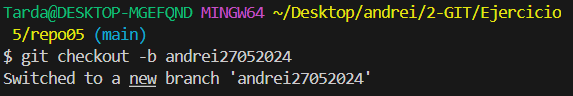

# Ejercicio 5

## 5.1
Yo he creado el repo en remoto y le he hecho un clone, asi me ahorraba tener que hacer init, cambiar la branca a main, añadir repositorio remoto y todo eso.

## 5.2
El fichero readme es este. Por ello no necesito crear ninguno

## 5.3
