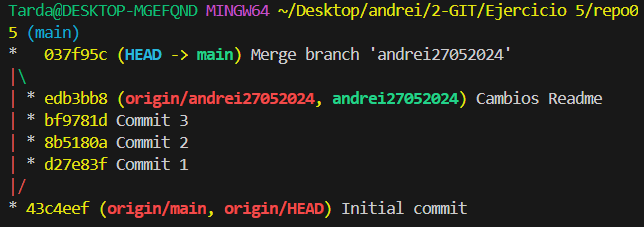

# Ejercicio 5

## 5.1
Yo he creado el repo en remoto y le he hecho un clone, asi me ahorraba tener que hacer init, cambiar la branca a main, añadir repositorio remoto y todo eso.

## 5.2
El fichero readme es este. Por ello no necesito crear ninguno nuevo porque el remoto ya me lo ha creado

## 5.3

## 5.4

## 5.5

## 5.6

## 5.7

## 5.8
La diferencia entre FF y no-FF es que al hacer FF, la rama en la que estemos, se hare el merge directo a la rama main sin un commit de confirmacion, entonces al hacer eso, si otra persona quiere saber cuanod se hizo el merge no lo sabra porque no habra nada que lo indique mientras que con no-ff, pide un commit de confirmacion que marca cuando se hace el merge de la rama a la otra rama